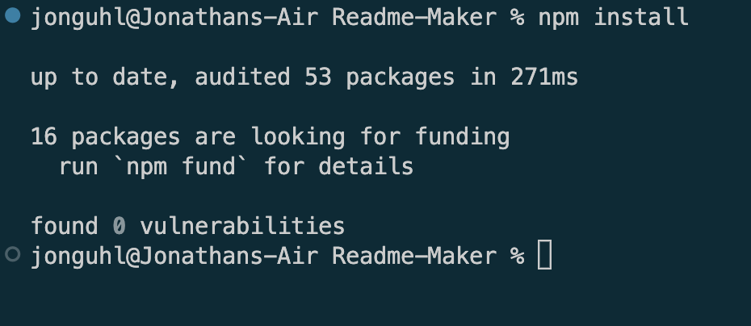
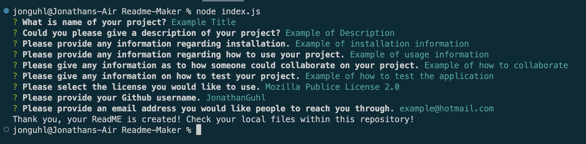
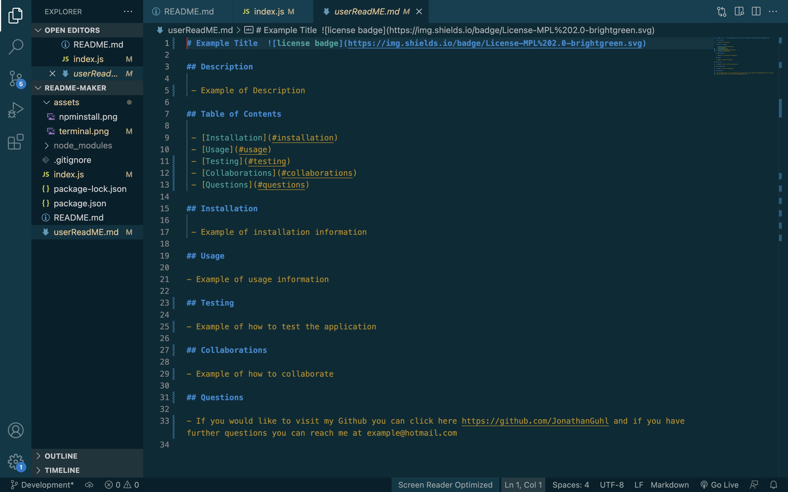

# Node ReadME File Generator 

- Here I have a simple command line application that allows you to create a professional ReadME using [Node.JS](https://nodejs.org/en/) with the help of the [Inquirer NPM](https://www.npmjs.com/package/inquirer/v/8.2.4#examples)

## Installation

- Before you can run this application you will need to install [Node.JS](https://nodejs.org/en/download/) if you don't already have it installed.

## Usage

- Before I give you step by step instructions, click this [link](assets/Application Tutorial.mp4) for the video. If you need further help after the video, follow the step by step instructions under the video.
- First, you will need to clone the repository using `git clone git@github.com:JonathanGuhl/Readme-Maker.git`
- Second, open your terminal or use the terminal within whatever IDE you use and `cd` into whatever filed you stored the clone of the repository in.
- Third, before you run the node commands you will need to type `npm install`. You will only need to run this comman the first time after you've cloned this repository. After you've run `npm install` you will see this in the terminal 

- Fourth, once you have used `npm install` to install the inquirer NPM, using the command line run `node index.js` Make sure you have [Node.JS](https://nodejs.org/en/download/) installed before you do this!
- From there on the the command line you will be asked a series of questions. 
- Once you have answered all of the questions your terminal should look like so 
 
- After you have successfully answered all of the questions, your ReadME file will be created in your cloned repository under the name 'userReadMe.md'
- Your new ReadME will look like so 
 
- After that you're free to copy or edit the ReadME and use it where you see necessary!
